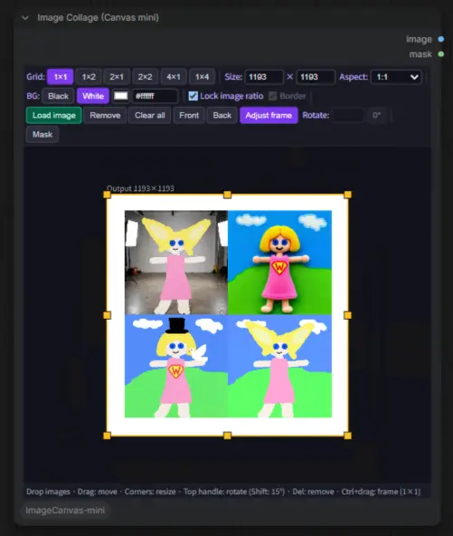

# ComfyUI-ImageCanvas-mini

**日本語** | [English](#english)

ComfyUI 上で動く、シンプルな画像編集ツールです。
ノードの上で直接、GUI でコラージュ画像の作成と微調整ができます。

- 画像をノードにドラッグ&ドロップして並べ、位置・大きさ・角度をマウスで調整し、合成した画像を出力します。
- 機能が多すぎるとわかりにくくなるので、必要最低限の機能に絞っています。
- 細かい画像処理は AI に投げればいいので、ノード上でのレタッチ機能は実装していません(レイヤー編集機能は将来実装するかもしれません)。
- 単純な画像のリサイズやパディングの用途にも使えます。



ノードは **Image Collage (Canvas mini)** の 1 つです(カテゴリ `ImageCanvas-mini`)。

## インストール

```
cd ComfyUI/custom_nodes
git clone https://github.com/id-fa/ComfyUI-ImageCanvas-mini
```

ComfyUI を再起動してください。Python の依存パッケージは追加されません。

## 使い方

画像の入力スロットはありません。画像はノードに直接読み込みます。

1. ノードを追加し、画像をキャンバスにドラッグ&ドロップします(`Load image` ボタン、またはキャンバスをクリックしてから `Ctrl+V` でクリップボードの画像を貼り付けることもできます)。複数枚まとめてドロップできます。
2. 画像をクリックして選択し、ドラッグで移動、四隅のハンドルでリサイズ、上に伸びた丸いハンドルで回転します。
3. ワークフローを実行すると、破線の出力枠の内側がそのまま `image` として出力されます。

枠の外側は作業用の領域です。はみ出した部分は半透明で表示され、出力されません。
配置はワークフローと一緒に保存されます。

### 出力

| 出力 | 内容 |
|---|---|
| `image` | 合成した画像 |
| `mask` | ノード上で塗ったマスク(塗った所が 1)。何も塗っていなければ全面 0 |

### レイアウト

| 項目 | 内容 |
|---|---|
| `Grid` | `1×1` は自由配置(何枚でも重ねて置ける)。それ以外はグリッドで、1 セルに 1 枚、セルを埋めるように配置されます |
| `Size` | 出力画像の幅 × 高さ(16〜8192) |
| `Aspect` | 出力のアスペクト比。固定すると、幅と高さの片方を変えたときにもう片方が自動で追従します。`Custom` で `5:4` や `1.85` のように指定できます |
| `BG` | 背景(余白)の色。Black / White のほか、カラーピッカーと色コード(`#808080`)で指定できます |
| `Border` | グリッドの枠線の有無(`1×1` では描きません) |

### 画像の操作

| 操作 | 内容 |
|---|---|
| ドラッグ | 移動 |
| 四隅のハンドル | リサイズ。`Lock image ratio` を外すと縦横比を変えられます |
| 上の丸いハンドル | 回転。`Shift` を押している間は 15° 刻み |
| `Rotate` | 角度を数値で指定(時計回り)。`0°` でリセット |
| `Front` / `Back` | 重なり順の変更(`1×1` のみ) |
| `Remove` / `Delete` キー | 選択した画像を外す |
| `Clear all` | すべての画像(と `Paint all` の描画)を外す |

### 描画(`Paint` / `Paint all`)

ラフスケッチや、AI に編集箇所を指示するためのマークを描けます。簡単なペイントエディタが全画面で開きます。

| ボタン | 内容 |
|---|---|
| `Paint` | 選択した画像に直接描きます。`Save (+bg)` で画像+線、`Save (lines)` で白地に線だけを新しい画像として保存し、セルの画像を差し替えます(元の画像ファイルは残ります)。空のセルを選んで押すと、セルと同じサイズの白紙から描けます |
| `Paint all` | コラージュ全体の上に描きます。線は別のレイヤーとして保存され、下の画像はその後も動かせます。もう一度開けば線の続きを描いたり消しゴムで消したりでき、`Clear` して保存するとレイヤーが消えます |

エディタのツール: `Pen` / `Brush`(筆圧)/ `Air`(エアブラシ)/ `Eraser`(線だけ消す)/ `Cover`(白で塗りつぶし)/ `Select`(矩形を選んでコピーし、`Paste` で貼り付け・移動・リサイズ)。`Undo`(`Ctrl+Z`)、`Esc` で閉じます。

### 出力枠の調整(`1×1` のみ)

先に画像を並べてから、切り抜く範囲を決められます。
`Adjust frame` ボタンを押すか、`Ctrl` を押しながら操作します。

- 枠の内側をドラッグ: 枠を移動
- 枠の辺・角をドラッグ: 枠をリサイズ(アスペクト比を固定していれば比率を保ちます)

画像はその場に残り、枠だけが動きます。

### マスク

`Mask` ボタンでマスクの編集に入ります(この間、画像は動かせません)。inpaint 用のマスクを出力全体に対して塗れます。

| 項目 | 内容 |
|---|---|
| `Brush` / `Eraser` | 塗る / 消す |
| `Size` | ブラシの太さ(出力ピクセル単位) |
| `Undo` | 1 手戻す(`Ctrl+Z` でも可) |
| `Clear mask` | マスクをすべて消す |

## リサイズ・パディングに使う

`Grid` を `1×1` にして画像を 1 枚だけ置くと、画像は出力枠に収まる大きさで中央に配置されます。

- **リサイズ**: `Aspect` を画像と同じ比率にして `Size` を変える
- **パディング**: `Size` や `Aspect` を変えて余白を作り、`BG` で余白の色を決める

## メモ

- 読み込んだ画像は ComfyUI の `input/imagecanvas_mini/` に保存されます。ワークフローを他の環境に持っていく場合は、このフォルダの画像も必要です。
- マスクはブラシの軌跡としてワークフロー内に保存されます(画像ファイルは作りません)。
- `Paint` の結果は `<元の名前>_paint.png`、`Paint all` のレイヤーは `collage_overlay.png` として同じフォルダに保存されます(同名で内容が違うと連番が付きます)。

## ライセンス

MIT

---

<a id="english"></a>

# ComfyUI-ImageCanvas-mini (English)

[日本語](#comfyui-imagecanvas-mini) | **English**

A simple image editing tool that runs on ComfyUI.
Build a collage and fine-tune it with a GUI, right on the node.

- Drag and drop images onto the node, adjust position, size and angle with the mouse, and output the composited image.
- Too many features make a tool hard to understand, so this one keeps to the bare minimum.
- Detailed image processing can be handed to AI, so there are no retouching features on the node (layer editing may be added in the future).
- It also works for plain image resizing and padding.

There is one node: **Image Collage (Canvas mini)** (category `ImageCanvas-mini`).

## Installation

```
cd ComfyUI/custom_nodes
git clone https://github.com/id-fa/ComfyUI-ImageCanvas-mini
```

Restart ComfyUI. No Python dependencies are added.

## Usage

The node has no image input slot. Images are loaded directly into the node.

1. Add the node and drag and drop images onto its canvas (or use the `Load image` button, or click the canvas and press `Ctrl+V` to paste an image from the clipboard). You can drop several at once.
2. Click an image to select it, then drag to move, use the corner handles to resize, and the round handle above it to rotate.
3. Run the workflow. Whatever is inside the dashed output frame is output as `image`.

The area outside the frame is a work area. Parts that stick out are shown semi-transparent and are not output.
The arrangement is saved with the workflow.

### Outputs

| Output | Content |
|---|---|
| `image` | The composited image |
| `mask` | The mask painted on the node (1 where painted). All 0 if nothing is painted |

### Layout

| Item | Description |
|---|---|
| `Grid` | `1×1` is the free layout (any number of images, overlapping). The others are grids: one image per cell, placed to fill the cell |
| `Size` | Output width × height (16–8192) |
| `Aspect` | Output aspect ratio. When fixed, changing width or height adjusts the other automatically. `Custom` accepts values such as `5:4` or `1.85` |
| `BG` | Background (padding) color: Black / White, a color picker, or a color code (`#808080`) |
| `Border` | Grid border lines on or off (never drawn for `1×1`) |

### Editing images

| Action | Description |
|---|---|
| Drag | Move |
| Corner handles | Resize. Uncheck `Lock image ratio` to change the proportions |
| Round handle on top | Rotate. Hold `Shift` for 15° steps |
| `Rotate` | Enter the angle as a number (clockwise). `0°` resets it |
| `Front` / `Back` | Change the stacking order (`1×1` only) |
| `Remove` / `Delete` key | Remove the selected image |
| `Clear all` | Remove all images (and the `Paint all` drawing) |

### Drawing (`Paint` / `Paint all`)

For rough sketches, or marks that tell an AI what to edit. A simple full-screen paint editor opens.

| Button | Description |
|---|---|
| `Paint` | Draw directly on the selected image. `Save (+bg)` stores image + lines, `Save (lines)` the lines on white, as a new image that replaces the one in the cell (the original file is kept). With an empty cell selected it starts from a blank canvas of the cell's size |
| `Paint all` | Draw over the whole collage. The lines are stored as a separate layer, so the images underneath stay editable. Open it again to continue or erase lines; `Clear` and save removes the layer |

Editor tools: `Pen` / `Brush` (pressure) / `Air` (airbrush) / `Eraser` (lines only) / `Cover` (paint over with white) / `Select` (select a rectangle to copy, then `Paste` to place, move and resize it). `Undo` (`Ctrl+Z`), `Esc` closes.

### Adjusting the output frame (`1×1` only)

Arrange the images first, then decide what to crop.
Press the `Adjust frame` button, or hold `Ctrl` while dragging.

- Drag inside the frame: move the frame
- Drag an edge or corner: resize the frame (keeps the ratio if the aspect is fixed)

The images stay where they are; only the frame moves.

### Mask

The `Mask` button switches to mask editing (images cannot be moved meanwhile). Paint an inpaint mask over the whole output.

| Item | Description |
|---|---|
| `Brush` / `Eraser` | Paint / erase |
| `Size` | Brush width (in output pixels) |
| `Undo` | Undo one step (also `Ctrl+Z`) |
| `Clear mask` | Erase the whole mask |

## Resizing and padding

Set `Grid` to `1×1` and place a single image: it is fitted inside the output frame and centered.

- **Resize**: set `Aspect` to the image's ratio and change `Size`
- **Padding**: change `Size` or `Aspect` to create margins, and pick their color with `BG`

## Notes

- Loaded images are stored in ComfyUI's `input/imagecanvas_mini/`. To move a workflow to another environment, the images in this folder are needed too.
- The mask is saved inside the workflow as brush strokes (no image file is created).
- `Paint` results are stored as `<original name>_paint.png` and the `Paint all` layer as `collage_overlay.png` in the same folder (a counter is appended when the name exists with different content).

## License

MIT
